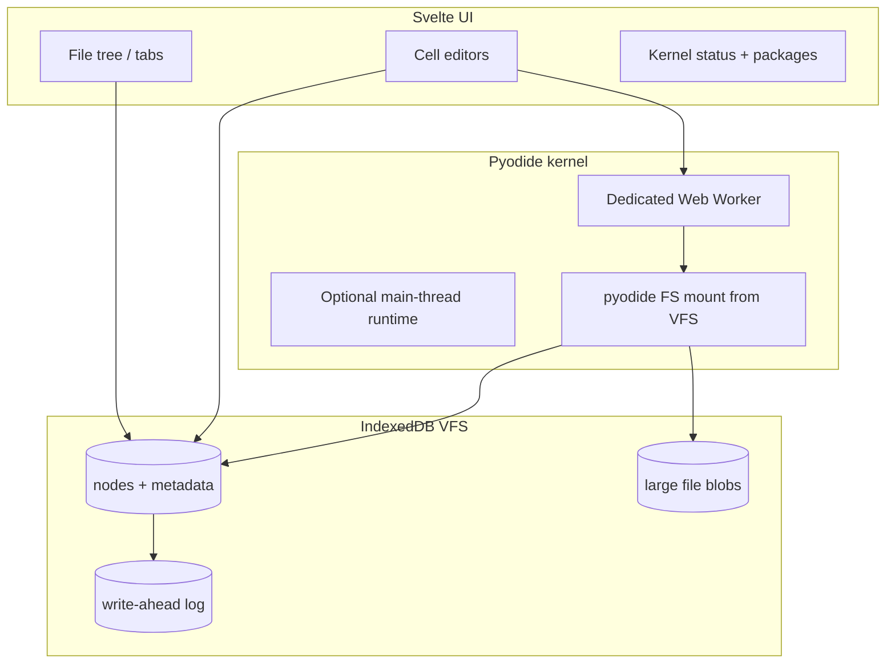

# Implementation plan: in-browser Python notebook server

Goal: a **fully client-side** notebook experience comparable to a lightweight Jupyter workflow—**Pyodide** for execution, **IndexedDB** for durable files, **SvelteKit** static export for GitHub Pages—without a traditional backend.

## Current state (Phase 0 — shipped in this repo)

| Area | Status |
|------|--------|
| SvelteKit static app (`adapter-static`, base `/inbrowser-python-notebooks`) | Done |
| GitHub Actions `deploy.yml` | Done |
| IndexedDB snapshot store + tree CRUD primitives (`src/lib/vfs/`) | Done |
| JSON notebook document format (`.ipynb.json`) | Done |
| Pyodide lazy load + per-cell run (`src/lib/pyodide/runtime.js`) | Done |
| Minimal UI: file list, code cells, run output | Done |

## Architecture target



### Design principles

1. **No server for user data** — all notebooks and assets stay in the browser; export/import is the portability path.
2. **One kernel per notebook tab** — avoid multiple Pyodide instances; use a worker for UI responsiveness.
3. **VFS is the source of truth** — Pyodide’s virtual FS is a **projection** of IndexedDB, synced on save/run.
4. **Small dependency surface** — prefer native APIs; add Monaco or micropip only when phases require them.

---

## Phase 1 — IndexedDB “file server” (full VFS)

Treat IndexedDB as a POSIX-like layer the notebook kernel can rely on.

### 1.1 Schema (version 2 migration)

- **`nodes`** object store: `{ id, parentId, name, type, updatedAt, size, mimeType, blobKey? }`
- **`blobs`** store: `blobKey → ArrayBuffer | Blob` for large assets (images, CSV, wheels cache)
- **`journal`** store: append-only ops for crash recovery (`PUT`, `DELETE`, `MOVE`)
- **`workspaces`** store: multiple roots (personal, course templates)

Indexes: `parentId`, `name+parentId` (unique among siblings).

### 1.2 API surface (`src/lib/vfs/`)

| Function | Behavior |
|----------|----------|
| `readdir(path)` | List children by path segments |
| `readFile(path, encoding)` | UTF-8 text or binary |
| `writeFile(path, data)` | Create or replace; update journal |
| `mkdir`, `rename`, `unlink`, `stat` | Tree mutations with optimistic UI |
| `exportWorkspace()` | Single `.zip` or JSON bundle download |
| `importWorkspace(file)` | Merge or replace workspace |

### 1.3 Consistency & performance

- Debounced writes (250–500 ms) for editor buffers; explicit flush on Run / tab close (`beforeunload`).
- `structuredClone` + `transaction` per logical operation; batch sibling listing reads.
- Quota handling: surface `navigator.storage.estimate()` in settings; prompt before large imports.

### 1.4 Tests

- Node unit tests for path resolution and tree invariants (no IndexedDB).
- Playwright smoke: create file → reload → content persists.

---

## Phase 2 — Notebook document model

### 2.1 Format

- Support **native `.ipynb`** (nbformat 4.x) import/export, mapping to internal `NotebookDocument`.
- Cell types: `code`, `markdown`, `raw`.
- Metadata: kernel spec, pyodide version pin, micropip package list.

### 2.2 Execution model

- **Session state** persists across cells (variables, imports).
- `Shift+Enter` run cell and advance; `Ctrl+Enter` run in place.
- Interrupt: worker `terminate()` + restart kernel (document limitation in browser).

### 2.3 Markdown

- Render with a minimal markdown pipeline (no heavy CMS); sanitize HTML output.

---

## Phase 3 — Pyodide kernel (production-grade)

### 3.1 Web Worker kernel (`static/pyodide-kernel.worker.js`)

- Load Pyodide via `importScripts` from jsDelivr (same pattern as classic workers; avoids bundler breaking `import pyodide`).
- Message protocol: `init`, `runCell`, `installPackage`, `reset`, `syncFs`.
- Stream stdout/stderr back as incremental chunks for long runs.

### 3.2 File system bridge

- On workspace sync, write VFS text files into `pyodide.FS` under `/workspace`.
- Binary files via `FS.writeFile` with Uint8Array from blob store.
- After cell run, optional **pull** of generated files from FS back into VFS (`./output.csv`).

### 3.3 Packages

- `micropip.install` for pure-Python wheels; document limitations (no arbitrary C extensions unless Pyodide ships them).
- Cache downloaded wheels in IndexedDB `blobs` keyed by URL + version.

### 3.4 Preload / UX

- Loading bar with package manifest size estimate.
- Pin Pyodide version in `runtime.js` and worker; upgrade via explicit migration note in settings.

---

## Phase 4 — Editor & notebook chrome

- **Monaco** or **CodeMirror 6** for Python cells (syntax highlight, indentation).
- Cell add/delete/reorder drag handles.
- Sidebar: file tree with folders, search, recent files.
- Optional **PWA** offline shell (cache static assets only; Pyodide still CDN unless self-hosted in `static/pyodide/`).

---

## Phase 5 — Collaboration & portability (still no backend)

- Export notebook + workspace as `.zip` (JSZip or manual ZIP structure).
- Share via file download only; optional read-only “gist style” URL hash embedding **not** recommended for large notebooks.
- Settings: default Python version, theme, editor keymap.

---

## SvelteKit structure (conventions)

```
src/
  lib/
    vfs/           # IndexedDB + path API (no Svelte imports in pure modules)
    notebook/      # Parse, serialize, cell ops
    pyodide/       # Loader, worker client, types
    stores/        # Optional: thin wrappers if multiple routes need shared state
    components/    # NotebookWorkspace, FileTree, CellEditor
  routes/
    +layout.js     # prerender + trailingSlash
    +page.svelte   # main notebook app
static/
  pyodide-kernel.worker.js   # phase 3
```

- Use **`$lib/...`** imports; keep VFS logic testable without `browser` guard in pure helpers.
- **`export const prerender = true`** for GitHub Pages; no server endpoints.
- Base path **`/inbrowser-python-notebooks`** must match `svelte.config.js`, `vite.config.js`, and Pages settings.

---

## GitHub Pages deployment

1. Repository **Settings → Pages → Build and deployment**: **GitHub Actions**.
2. Push to `main` triggers `.github/workflows/deploy.yml`.
3. Site URL: `https://<user>.github.io/inbrowser-python-notebooks/`

Local dev: `npm install && npm run dev` → `http://localhost:4174/inbrowser-python-notebooks/`.

---

## Risk register

| Risk | Mitigation |
|------|------------|
| Pyodide download size / cold start | Worker + progress UI; optional self-host `full/` on Pages |
| IndexedDB quota | Blob store split; export prompt; storage estimate UI |
| Single-threaded UI if kernel on main thread | Mandatory worker in phase 3 |
| nbformat edge cases | Fuzz tests on sample `.ipynb` files; graceful import errors |
| GitHub Pages base path | `paths.base` + `touch dist/.nojekyll` |

---

## Suggested milestone order

1. Phase 1 VFS API + migrations + import/export zip  
2. Phase 3 worker kernel + FS bridge (unblocks real multi-cell workflows)  
3. Phase 2 nbformat + markdown  
4. Phase 4 editor polish  
5. Phase 5 portability extras  

This ordering prioritizes **durable files + reliable execution** before editor luxuries.
